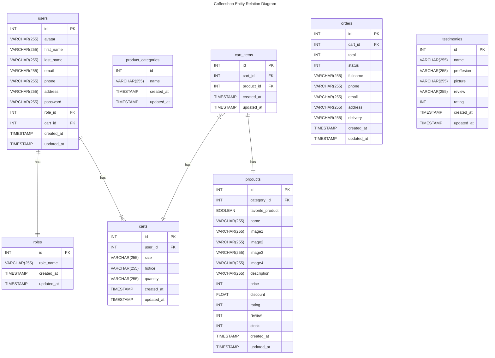

# Coffeeshop ERD

```mermaid
---
title: Coffeeshop Entity Relation Diagram
---
    erDiagram

    users {
        INT id PK 
        VARCHAR(255) avatar
        VARCHAR(255) first_name
        VARCHAR(255) last_name
        VARCHAR(255) email
        VARCHAR(255) phone
        VARCHAR(255) address
        VARCHAR(255) password
        INT role_id FK
        INT cart_id FK
        TIMESTAMP created_at
        TIMESTAMP updated_at
    }

    roles{
        INT id PK 
        VARCHAR(255) role_name
        TIMESTAMP created_at
        TIMESTAMP updated_at
    }

    products {
        INT id PK
        INT category_id FK
        BOOLEAN favorite_product
        VARCHAR(255) name
        VARCHAR(255) image1
        VARCHAR(255) image2
        VARCHAR(255) image3
        VARCHAR(255) image4
        VARCHAR(255) description
        INT price
        FLOAT discount
        INT rating
        INT review
        INT stock
        TIMESTAMP created_at
        TIMESTAMP updated_at
    }

    product_categories {
        INT id
        VARCHAR(255) name
        TIMESTAMP created_at
        TIMESTAMP updated_at
    }

    carts{
        INT id PK
        INT user_id FK
        VARCHAR(255) size
        VARCHAR(255) hotice
        VARCHAR(255) quantity
        TIMESTAMP created_at
        TIMESTAMP updated_at
    }

    cart_items{
        INT id PK
        INT cart_id FK
        INT product_id FK
        TIMESTAMP created_at
        TIMESTAMP updated_at
    }
    
    orders{
        INT id PK
        INT cart_id FK
        INT total
        INT status
        VARCHAR(255) fullname
        VARCHAR(255) phone
        VARCHAR(255) email
        VARCHAR(255) address
        VARCHAR(255) delivery
        TIMESTAMP created_at
        TIMESTAMP updated_at
    }

        testimonies {
        INT id PK
        VARCHAR(255) name
        VARCHAR(255) proffesion
        VARCHAR(255) picture
        VARCHAR(255) review
        INT rating
        TIMESTAMP created_at
        TIMESTAMP updated_at
    }

    users only one to only one roles : has
    users only one to one or more carts : has
    cart_items one or more to only one carts : has
    cart_items only one to only one products : has
```